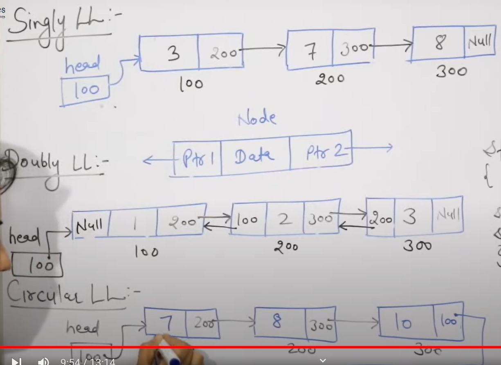
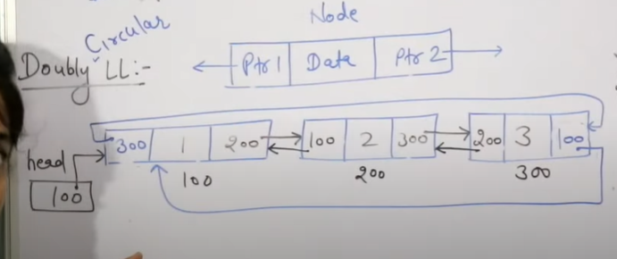

**Linked List**

A linked list is a linear data structure, in which the elements are not stored at contiguous memory locations. The elements in a linked list are linked using pointers.

**Advantagies** 

you can insert new elment in array or linked list easyily 

**Types of LinkedList**

1.single LL 2.double LL 3.circular LL 4.double circulat LL

--Double circular LL

